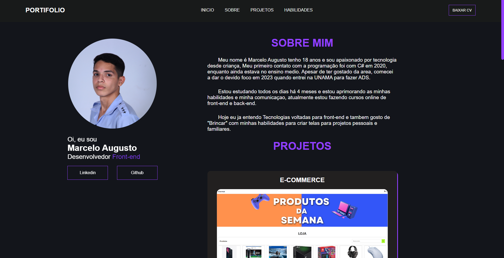

# PORTIFOLIO PESSOAL 🙋‍♂️
<h1>
     
    <a href="https://marceloaugusto33.github.io/PORTIFOLIO/">PROJETO EM AÇAO!!</a>
</h1>

## 📕 SOBRE

Bem-vindo ao meu portfólio, uma coleção de projetos que refletem minha paixão pela criação web. Explore meu mundo digital e descubra como combino HTML, CSS e JavaScript para construir experiências funcionais.

## 🔨 FERRAMENTAS

- [HTML](https://developer.mozilla.org/pt-BR/docs/Web/HTML)
- [CSS](https://developer.mozilla.org/pt-BR/docs/Web/CSS)
- [JAVASCRIPT](https://developer.mozilla.org/pt-BR/docs/Web/JavaScript)

## 📃 LICENÇA
Esse projeto utiliza licença MIT. Veja o arquivo da [licença](https://github.com/MarceloAugusto33/PORTIFOLIO/blob/main/LICENSE) para mais detalhes.

